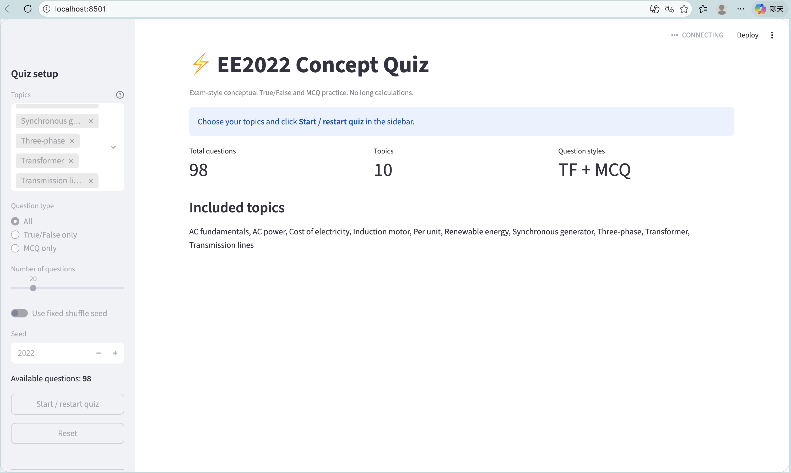
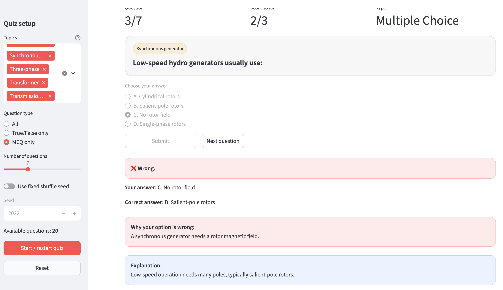

# EE2022 TF/MCQ Review Tool

A Streamlit-based conceptual quiz tool for EE2022 revision. It includes True/False and multiple-choice conceptual questions covering AC power, three-phase systems, generators, transformers, per-unit analysis, transmission lines, induction motors, renewable energy integration, and electricity cost concepts.

If this tool helps with your EE2022 revision, please consider giving the repository a ⭐ Star. It helps other students find it more easily and lets me know the tool is useful.

## Screenshots

### Quiz setup



### MCQ feedback



## Files

- `ee2022_concept_quiz.py` — question bank and command-line quiz version
- `ee2022_concept_quiz_ui.py` — Streamlit UI version
- `requirements.txt` — Python dependencies

## Run locally

```bash
python3 -m pip install -r requirements.txt
python3 -m streamlit run ee2022_concept_quiz_ui.py
```

If the browser does not open automatically, visit:

```text
http://localhost:8501
```

## Notes

The MCQ mode explains why a selected wrong option is wrong and shows the correct answer explanation.
